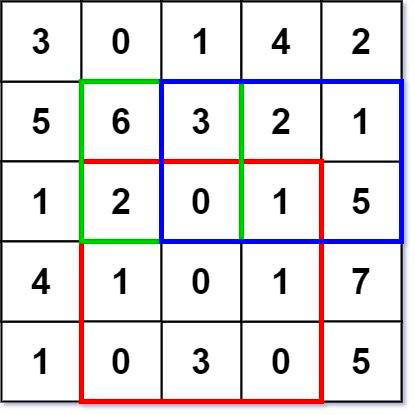

<h2>Range Sum Query 2D - Immutable</h2>

Given a 2D matrix <code>matrix</code>, handle multiple queries of the following type:

<ul>
    <li>Calculate the <b>sum</b> of the elements of <code>matrix</code> inside the rectangle defined by its <b>upper 
        left corner</b> <code>(row1, col1)</code> and <b>lower right corner</b> <code>(row2, col2)</code>.</li>
</ul>

Implement the <code>NumMatrix</code> class:

<ul>
    <li><code>NumMatrix(int[][] matrix)</code> Initializes the object with the integer matrix <code>matrix</code>.</li>
    <li><code>int sumRegion(int row1, int col1, int row2, int col2)</code> Returns the <b>sum</b> of the elements of 
        <code>matrix</code> inside the rectangle defined by its <b>upper left corner</b> <code>(row1, col1)</code> and 
        <b>lower right corner</b> <code>(row2, col2)</code>.</li>
</ul>

You must design an algorithm where <code>sumRegion</code> works on <code>O(1)</code> time complexity.

<h3>Example 1:</h3>

 

<b>Input:</b> <code> 
["NumMatrix", "sumRegion", "sumRegion", "sumRegion"] 
[[[[3, 0, 1, 4, 2], [5, 6, 3, 2, 1], [1, 2, 0, 1, 5], [4, 1, 0, 1, 7], [1, 0, 3, 0, 5]]], [2, 1, 4, 3], [1, 1, 2, 2], [1, 2, 2, 4]]</code>

<b>Output:</b> <code>[null, 8, 11, 12]</code>

<b>Explanation:</b><code> 
NumMatrix numMatrix = new NumMatrix([[3, 0, 1, 4, 2], [5, 6, 3, 2, 1], [1, 2, 0, 1, 5], [4, 1, 0, 1, 7], [1, 0, 3, 0, 5]]); 
numMatrix.sumRegion(2, 1, 4, 3); // return 8 (i.e sum of the red rectangle) 
numMatrix.sumRegion(1, 1, 2, 2); // return 11 (i.e sum of the green rectangle) 
numMatrix.sumRegion(1, 2, 2, 4); // return 12 (i.e sum of the blue rectangle)</code>

<h3>Constraints:</h3>
<ul>
    <li><code>m == matrix.length</code></li>
    <li><code>n == matrix[i].length</code></li>
    <li><code>1 <= m, n <= 200</code></li>
    <li><code>-104 <= matrix[i][j] <= 104</code></li>
    <li><code>0 <= row1 <= row2 < m</code></li>
    <li><code>0 <= col1 <= col2 < n</code></li>
    <li>At most <code>104</code> calls will be made to <code>sumRegion</code>.</li>
</ul>